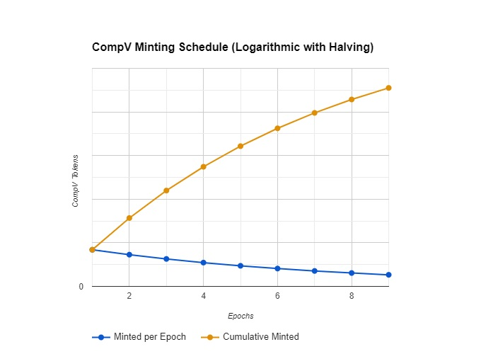

<p align="center">
    <picture>
        <source media="(prefers-color-scheme: dark)" srcset=".docs/Compound-v.jpg">
        
    </picture>
</p>

## Overview

Compound-V is a native token on the Hedera Network.


## Tokenomics

1. **Total Supply**: The total supply of CompV is capped at **42 million** tokens, a wink at the "answer to life, the universe, and everything" from The Hitchhiker's Guide to the Galaxy.
2. **Minting Process**: CompV minting follows a **logarithmic curve**, rewarding early borrowers with large allocations of tokens. Over time, the minting rate decreases, halving every epoch until the last token is minted on **Bitcoin's next halving day**. This creates a distribution that benefits early participants while keeping inflation under control as the project matures.
3. **Token Utility**: When users **stake** their CompV tokens, they earn a **share of the protocol's revenue** in proportion to the amount of tokens staked. This gives holders a direct incentive to participate in the ecosystem and benefit from its growth.

Total minting formula:
```math
Total Minted = (S / 2) * (1 - 0.5^n)
```
> Where, (`S`) is the total supply and (`n`) is the number of epoch 

 

<p align="center">
    <picture>
        <source media="(prefers-color-scheme: dark)" srcset=".docs/compv-graph.jpg">
        
    </picture>
</p>
